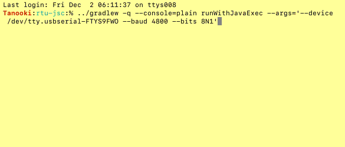

# Nifty Modbus: RTU jSerialComm

This project adds support for Modbus RTU (serial port) using the [jSerialComm][jsc] library for the
serial port support (that Java itself lacks).

# Modbus Shell



A basic interactive Modbus shell application is provided, via the 
`net.solarnetwork.io.modbus.rtu.jsc.JscModbusShell` class. This can be run directly from Gradle
using the `runWithJavaExec` task, for example:

```sh
../gradlew -q --console=plain runWithJavaExec --args='--device /dev/ttyUSB0 --bits 8N1'
```

## Application arguments

The following application arguments are supported:

| Argument | Default | Description |
|:---------|:--------|:------------|
| `--device` `--dev` |  | The serial device to use, for example `/dev/ttyUSB0` or `COM1`. |
| `--baud` `-b` | `115200` | The baud rate to use. |
| `--data` `-d` | `8` | The number of data bits. |
| `--parity` `-P` | `none` | The parity. One of `none`/`n`, `even`/`e`, `odd`/`o`. |
| `--stop` `-s` | `1` | The number of stop bits. One of `1` or `2`. |
| `--bits` | `8N1` | A shorthand form of the data, parity, and stop options. |
| `--debug` |  | Enables support for wire-level message logging. See [below](#logging). |

## Logging

Logging is handled via slf4j. If you are executing the Modbus Shell via Gradle you can create
a `src/test/resources/logback.xml` file to configure Logback logging.

### Wire logging

You can enable "wire" logging to see detailed information about all Modbus messages sent and
received. The logger used is named like `net.solarnetwork.io.modbus.DEVICE` where `DEVICE` is the
serial device name. It logs to the `DEBUG` level. Additionally you must pass the `--debug` argument
to the application.

An example wire-level log message looks like this:

```
2022-12-02 18:29:41,580 [oioEventLoopGroup-2-1] DEBUG n.s.i.m./dev/tty.usbserial-FTYS9FWO - [id: 0x079a2084, L:localhost - R:/dev/tty.usbserial-FTYS9FWO] WRITE: 8B
         +-------------------------------------------------+
         |  0  1  2  3  4  5  6  7  8  9  a  b  c  d  e  f |
+--------+-------------------------------------------------+----------------+
|00000000| 01 03 00 00 00 0a c5 cd                         |........        |
+--------+-------------------------------------------------+----------------+
```

[jsc]: https://fazecast.github.io/jSerialComm/
