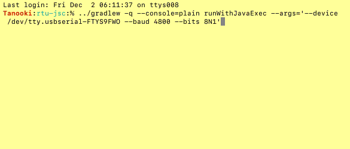

# Nifty Modbus: Interactive Shell

This project provides a basic command-line interactive shell application for interacting with
Modbus devices.



A basic interactive Modbus shell application is provided, via the 
`net.solarnetwork.io.modbus.shell.ModbusShell` class. This can be run directly from Gradle
using the `runWithJavaExec` task, for example:

```sh
../gradlew -q --console=plain runWithJavaExec --args='--device /dev/ttyUSB0 --bits 8N1'
```

# Application arguments

Both RTU and TCP are supported. For RTU use the `--device` argument and
for TCP use the `--host` and `--port` arguments.

The following application arguments are supported:

| Argument | Default | Description |
|:---------|:--------|:------------|
| `--device` `-dev` |  | The serial device to use, for example `/dev/ttyUSB0` or `COM1`. |
| `--host` `-h` |  | The TCP host to use, for example `1.2.3.4` or `host.example.com`. |
| `--port` `-p` | `502` | The TCP port to use for TCP connections. |
| `--baud` `-b` | `115200` | The baud rate to use. |
| `--data` `-d` | `8` | The number of data bits. |
| `--parity` `-P` | `none` | The parity. One of `none`/`n`, `even`/`e`, `odd`/`o`. |
| `--stop` `-s` | `1` | The number of stop bits. One of `1` or `2`. |
| `--bits` | `8N1` | A shorthand form of the data, parity, and stop options. |
| `--debug` |  | Enables support for wire-level message logging. See [below](#logging). |

# Read registers

To read registers, use the `read` command, followed by the type of registers to read:

 * `coils`, `coil`, `c` - read coil bit registers
 * `discretes`, `discrete`, `d` - read discrete input bit registers
 * `inputs`, `input`, `i` - read input 16-bit registers
 * `holdings`, `holding`, `h` - read holding 16-bit registers
 
 The following arguments are supported:
 
| Argument | Example | Description |
|:---------|:--------|:------------|
| `-1` | `-1` | Use **one-based** register addressing, instead of **zero-based**. |
| `--unit` `-a` | `--unit 1` | The unit ID of the device to communicate with. |
| `--register` `-r` | `--register 184` | The base-10 starting register address to read from. |
| `--register:hex` `-r:hex` | `--register:hex B8` | The base-16 starting register address to read from. |
| `--count` `-c` | `--count 10` | The number of registers to read. |

# Logging

Logging is handled via slf4j. If you are executing the Modbus Shell via Gradle you can create
a `src/main/resources/logback.xml` file to configure Logback logging.

## Wire logging

You can enable "wire" logging to see detailed information about all Modbus messages sent and
received. The logger used is named like `net.solarnetwork.io.modbus.DEVICE` where `DEVICE` is the
serial device name. It logs to the `DEBUG` level. Additionally you must pass the `--debug` argument
to the application.

Here's an example `logback.xml` that enables wire logging of the `/dev/tty.*` type of devices to the
console:

```xml
<configuration>

    <appender name="STDOUT" class="ch.qos.logback.core.ConsoleAppender">
        <encoder>
            <pattern>%d{ISO8601} [%thread] %-5level %logger{36} - %msg%n</pattern>
        </encoder>
    </appender>

    <logger name="net.solarnetwork.io.modbus./dev/tty" level="DEBUG"/>

    <root level="INFO">
        <appender-ref ref="STDOUT"/>
    </root>

</configuration>
```

An example wire-level log message looks like this:

```
2022-12-02 18:29:41,580 [oioEventLoopGroup-2-1] DEBUG n.s.i.m./dev/tty.usbserial-FTYS9FWO - [id: 0x079a2084, L:localhost - R:/dev/tty.usbserial-FTYS9FWO] WRITE: 8B
         +-------------------------------------------------+
         |  0  1  2  3  4  5  6  7  8  9  a  b  c  d  e  f |
+--------+-------------------------------------------------+----------------+
|00000000| 01 03 00 00 00 0a c5 cd                         |........        |
+--------+-------------------------------------------------+----------------+
```

[jsc]: https://fazecast.github.io/jSerialComm/
